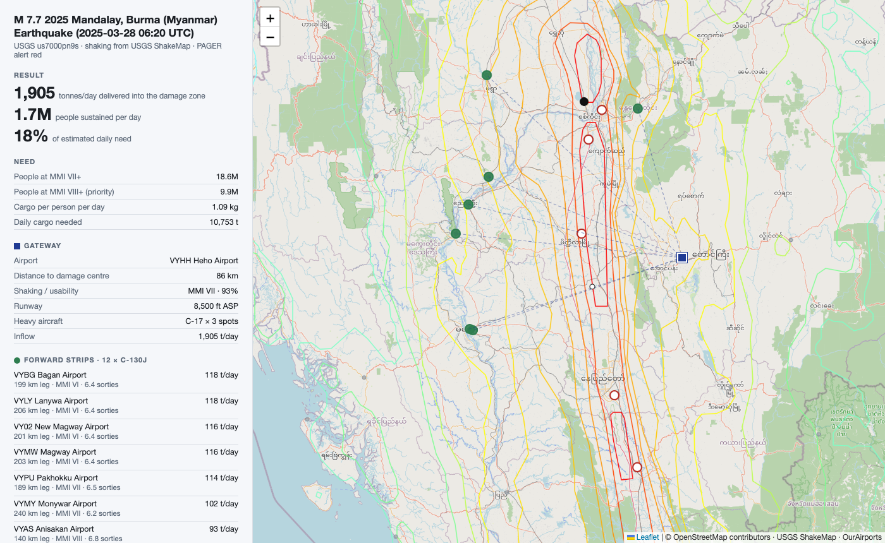

# Airlift Planner

**The nearest airport to an earthquake is usually the wrong one. This tool finds the right one, and says how many people it can feed.**



*Myanmar, March 2025. Red rings: airports the model expects to be knocked out (Mandalay and Nay Pyi Taw both lost their control towers that day). Blue square: the recommended gateway. Green: forward strips for the shuttle fleet. Lines: USGS shaking contours.*

## What it does

Given any earthquake in the USGS feed, in one command:

1. **Estimates whether each airfield survived.** Shaking intensity at every airport within 1,000 km, read off the USGS ShakeMap grid, turned into a probability the runway can take relief flights. This is the part nobody else does. Every mainstream tool ranks by distance, and distance is exactly what gets you a cracked runway.
2. **Sizes the need.** People exposed at intensity VIII and above (from USGS PAGER) times a minimum daily ration of food, medicine and shelter, in tonnes per day.
3. **Designs a two-tier airbridge.** Heavy jets into an undamaged gateway hub, C-130s shuttling the last leg into strips inside the damage zone. Capacity comes from ramp spots and turnaround times, the real bottlenecks, not runway length.
4. **Says how far short you are.** Delivered tonnes per day, people sustained, and the share of need that has to come by road or sea instead.

```
uv run main.py --quake us7000pn9s
```

```
M 7.7  2025 Mandalay, Burma (Myanmar) Earthquake  (2025-03-28 06:20 UTC)
shaking data: USGS ShakeMap   PAGER alert: red

people at MMI VIII+     9.9M   (airbridge priority)
cargo needed          10,753 t/day   at 1.09 kg/person/day

nearest airfield     VYST Shante Air Base                        49 km   MMI IX   usable 42%
likely knocked out:
    VYST Shante Air Base                        49 km   MMI IX   usable 42%
    VYNT Nay Pyi Taw International Airport     101 km   MMI IX   usable 26%
    VYMD Mandalay International Airport        133 km   MMI IX   usable 22%

GATEWAY   VYHH Heho Airport                               86 km   MMI VII  usable 93%
          C-17 x 3 spots, 8,500 ft   inflow 1,905 t/day
FORWARD   shuttle fleet 12 x C-130J, 20 h/day
          VYBG Bagan Airport                        199km      6.4     118   VI
          ...

DELIVERED INTO ZONE    1,905 t/day
people sustained        1.7M/day
coverage of need         18%   (rest must come by road, sea, or local supply)
```

## Does it work? Five real earthquakes, replayed

`uv run backtests/run.py` replays five major quakes and compares the plan with what relief operations actually did. Full detail in [backtests/RESULTS.md](backtests/RESULTS.md).

| event | airports the model flags as knocked out | what actually closed | gateway the model picks | gateway actually used |
|---|---|---|---|---|
| Haiti 2010, M7.0 | none (Port-au-Prince 63%) | none, but Port-au-Prince lost its tower and saturated | Port-au-Prince | Port-au-Prince, with Santo Domingo as overflow |
| Nepal 2015, M7.8 | none (Kathmandu 81%) | none, but Kathmandu's runway was damaged by heavy jets | Kathmandu | Kathmandu |
| Turkey 2023, M7.8 | Hatay, Kahramanmaras | Hatay (runway fractured); Kahramanmaras stayed open | Kayseri | Adana and Incirlik |
| Morocco 2023, M6.8 | none (Marrakech 96%) | none | Marrakech | Marrakech |
| Myanmar 2025, M7.7 | Mandalay, Nay Pyi Taw, three smaller fields | Mandalay and Nay Pyi Taw (towers collapsed) | Heho | Yangon |

Scorecard: every airport that really closed was flagged, with one false alarm (Kahramanmaras, borderline at 48%). The gateway matched reality in three of five. The two misses are interesting: in Turkey and Myanmar the model prefers an intact airport closer to the damage, while real operations chose the big international airport further away, for customs, fuel and handling capacity the model cannot see yet. Whether the model's answer would have been better is an open question.

Caveat: the airport table is today's, so two airports that did not exist at the time appear in the older replays. It is noted where it matters.

## How it works

| step | module | data |
|---|---|---|
| Fetch the quake, its shaking grid, its contours and its population exposure | `airlift/usgs.py` | USGS event feed, ShakeMap, PAGER (all public, no key) |
| Load every airport and runway on Earth | `airlift/airports.py` | OurAirports (public domain) |
| Shaking intensity to runway usability | `airlift/survivability.py` | judgement curve anchored on the five events above |
| Population exposure to tonnes per day | `airlift/demand.py` | WFP and Sphere planning figures |
| Gateway choice, shuttle allocation, coverage | `airlift/airbridge.py` | ramp spots, turnaround times, aircraft payloads |
| Terminal report and HTML map | `airlift/report.py` | Leaflet, OpenStreetMap |

Design choices worth knowing:

- The damage centre is the shaking-weighted centroid of the ShakeMap, not the epicentre. For a 400 km rupture like Myanmar's the two are far apart.
- Gateways are preferred inside the affected country. A cross-border hub needs diplomatic clearance the first days rarely allow. The best foreign alternative is still reported.
- Cargo landing at a gateway counts as delivered in full within 50 km of the damage centre, fading to zero at 150 km. Beyond that it has to fly the last leg.
- Regional airports are capped at C-17 class aircraft. They rarely have the pavement strength or ramp for a C-5 or 747.
- Small quakes with no ShakeMap fall back to a published intensity-vs-distance formula (Allen, Wald and Worden 2012), clearly labelled.

## What it is not

Not an operational tool. The usability curve is judgement, not a fitted model. Aircraft figures are public planning approximations. Distances are straight-line. It knows nothing about fuel stocks, customs, handling equipment, weather, airspace, or roads. It exists to show that a decision most tools get wrong can be got mostly right with free data and a few honest assumptions.

## Run it

Requires [uv](https://docs.astral.sh/uv/).

```
git clone https://github.com/sachabidermann/airlift-planner
cd airlift-planner
uv sync
uv run main.py --list                  # significant quakes this week
uv run main.py --latest                # plan for the newest one
uv run main.py --quake us7000pn9s      # any USGS event id
uv run main.py --quake us6000jllz --fleet 24 --forward-km 200
uv run backtests/run.py                # regenerate the five replays
```

Each plan also writes an interactive map to `out/<event id>.html`.

## Roadmap

- Fit the usability curve properly: collect every M6.5+ quake since 2000 with a known airport outcome
- Road travel time from gateway to damage centre instead of straight-line fading credit
- Helicopter tier for villages without a strip (this was the whole story in Morocco)
- Fuel and handling proxies for gateway choice, to close the Turkey and Myanmar gaps
- Other disaster feeds: cyclones, floods

## Why I built this

I'm a college freshman interested in decision-support software for defence and humanitarian operations. The pattern is the same in both: a situation, an inventory of assets, physical constraints, and a decision that has to be made fast with imperfect data. This is my first attempt at that pattern, built entirely on public data.
