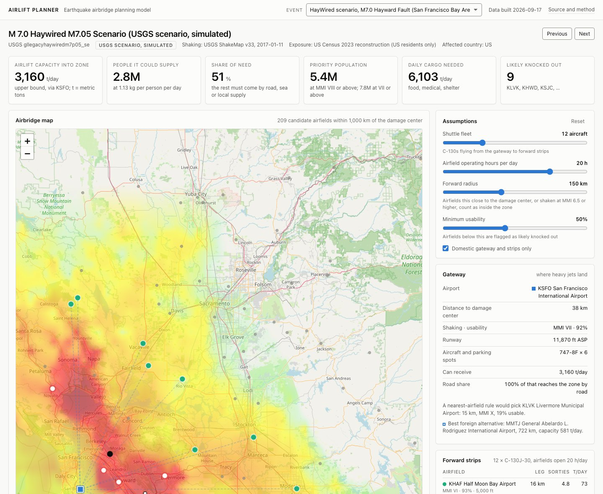

# Airlift Planner

[](https://github.com/sachabidermann/airlift-planner/actions/workflows/check.yml)

Airlift Planner estimates, for any earthquake in the USGS catalog, which nearby airfields can still take relief flights, how much cargo the hardest-hit population needs each day, and how much of that an airlift could move. It uses only public data: USGS ShakeMap and PAGER, US Census population files, and the OurAirports airport table.

It is a student project and a planning model, not an operational tool.

**Dashboard:** https://sachabidermann.github.io/airlift-planner/



*USGS HayWired scenario, a simulated M7.0 on the Hayward Fault. Red rings: airfields the model flags as likely knocked out. Blue square: the recommended gateway, San Francisco International. Shading: USGS ShakeMap intensity. Base map © [OpenStreetMap](https://www.openstreetmap.org/copyright) contributors.*

## Quick start

Requires [uv](https://docs.astral.sh/uv/). The first run downloads about 30 MB of public data into `data/`; the full check brings it to about 100 MB.

```
git clone https://github.com/sachabidermann/airlift-planner
cd airlift-planner
uv sync
uv run main.py --quake gllegacyhaywiredm7p05_se     # any USGS event or scenario id
uv run main.py --list                                # significant quakes this week
uv run main.py --latest                              # plan for the newest one
```

Abridged output for the HayWired scenario (`...` marks lines left out):

```
M 7.0  Haywired M7.05 Scenario  (USGS scenario, simulated)
shaking: USGS ShakeMap v33, 2017-01-11
...
people at MMI VIII+     5.4M   (airbridge priority)
cargo needed           6,103 t/day   at 1.13 kg per person per day

nearest airfield     KLVK Livermore Municipal Airport            15 km   MMI X    usable 19%
likely knocked out:
    KLVK Livermore Municipal Airport            15 km   MMI X    usable 19%
    KHWD Hayward Executive Airport              17 km   MMI IX   usable 37%
    KSJC Mineta San Jose International Airpo    26 km   MMI IX   usable 24%
    KOAK Oakland San Francisco Bay Airport      28 km   MMI IX   usable 27%
    ...

GATEWAY   KSFO San Francisco International Airport        38 km   MMI VII  usable 92%
          747-8F x 6 spots, 11,870 ft   inflow 3,160 t/day
...
AIRLIFT CAPACITY INTO ZONE    3,160 t/day   (upper bound; t = metric tons)
people it could supply         2.8M
share of need                   51%   the rest must come by road, sea or local supply
```

## Check it

```
scripts/check.sh --offline    # unit tests and the browser-model test; no network, a few seconds
scripts/check.sh              # also reruns the backtests, the verification and the dashboard build
```

[VERIFY.md](VERIFY.md) says what each step proves and what output to expect. The browser-model test needs Node.js. GitHub runs the offline checks on every push.

## Terms

- **MMI:** Modified Mercalli Intensity, a I to XII scale of how hard the ground shook at one place; ShakeMap reports values up to X. VI is strong shaking with light damage; VIII is severe with heavy damage.
- **ShakeMap:** the USGS map of estimated MMI around an earthquake, published as a grid and revised as data arrives.
- **PAGER:** the USGS estimate of how many people were exposed to each MMI level.
- **Airbridge:** a sustained shuttle of cargo flights into a disaster area.
- **Gateway:** the large airport, outside the worst damage, where heavy cargo jets land.
- **Forward strip:** any usable airfield inside the damage zone, from a small strip to an international airport, served by C-130s from the gateway.
- **Parking spot:** room for one cargo aircraft to unload. How many an airfield can work at once (the Air Force term is MOG, maximum on ground) limits throughput more than runway length does.
- **Sortie:** one round trip by one aircraft between the gateway and a forward strip.
- **Usability:** the model's probability that an airfield can take relief flights in the first days. Below 50% it is flagged as likely knocked out.
- **t/day:** metric tons (1,000 kg) per day.

## How it works

Formulas and the source of every constant are in [METHOD.md](METHOD.md).

1. **Usability.** Read the ShakeMap intensity at every airport within 1,000 km of the damage center and map it to a usability probability. A nearest-airfield rule picks the airport that was shaken hardest; this step is what avoids that.
2. **Need.** Take the people at MMI VIII and above, from PAGER, or from a Census reconstruction where PAGER was not run. Multiply by a daily ration of food, medical supplies and a share of a shelter kit: 1.13 kg per person per day.
3. **Airbridge.** Heavy jets fly into a gateway; C-130s shuttle cargo on to forward strips. Throughput uses the formula in Air Force Pamphlet 10-1403: parking spots × planning payload × operating hours ÷ ground time × 0.85. Every candidate gateway is worked out in full. The one that moves the most into the zone wins, except that candidates within 10% of the best count as tied and the nearest of them wins. Gateways in the affected country are preferred.
4. **Result.** Airlift capacity into the zone in t/day, how many people that could supply, and the share of need.

| module | job |
|---|---|
| `airlift/usgs.py` | Earthquake records, ShakeMap grids, PAGER exposure; real events and scenarios |
| `airlift/population.py` | Census exposure where PAGER was not run |
| `airlift/airports.py` | Airports and runways |
| `airlift/survivability.py` | Intensity to usability |
| `airlift/demand.py` | Exposure to metric tons per day |
| `airlift/aircraft.py` | Aircraft payloads, runway needs, ground times |
| `airlift/airbridge.py` | Damage center, gateway choice, shuttle allocation, capacity |
| `airlift/report.py`, `main.py` | Terminal report and command line |
| `backtests/` | Event definitions with sources, the backtest runner, the verification script, and their generated reports |
| `dashboard/` | Exports dashboard data and tests the browser port of the model |
| `docs/` | The static dashboard served by GitHub Pages |
| `tests/` | Unit tests |

## Backtests

Nine real earthquakes, compared with what happened. Generated detail, including the model's values at each airport that mattered and sources for every historical statement, is in [backtests/RESULTS.md](backtests/RESULTS.md).

| event | model flags as likely knocked out | what happened to airports | model gateway | relief gateway used | match |
|---|---|---|---|---|---|
| Loma Prieta 1989, M6.9 | none | Oakland lost 3,000 ft of runway to liquefaction | San Jose | none; mostly road | n/a |
| Anchorage 2018, M7.1 | none | none; reopened the same day | Anchorage | none | n/a |
| Ridgecrest 2019, M7.1 | none | China Lake not mission capable | Mojave | none | n/a |
| Puerto Rico 2020, M6.4 | none | none | San Juan | none | n/a |
| Haiti 2010, M7.0 | none | tower unusable, field saturated | Port-au-Prince | Port-au-Prince | yes |
| Nepal 2015, M7.8 | none | runway later damaged by heavy jets | Kathmandu | Kathmandu | yes |
| Turkey 2023, M7.8 | Kahramanmaras (48%), Hatay (34%) | Hatay closed six days | Gaziantep | Adana and Incirlik | no |
| Morocco 2023, M6.8 | none | none | Marrakech | Marrakech | yes |
| Myanmar 2025, M7.7 | Mandalay, Nay Pyi Taw, 3 other fields | Mandalay and Nay Pyi Taw closed to commercial flights for a week; relief flights from day 2 and day 4 | Heho | Yangon | no |

Gateway matches in 3 of the 5 events where a relief gateway was used. The other four earthquakes had no sustained relief airlift, so they only test the flags.

Three airports closed after the shaking (Hatay, Mandalay, Nay Pyi Taw) and the model flagged all three. Hatay was shut for six days. Nay Pyi Taw took military relief flights two days after the earthquake and Mandalay after four, so those two flags are only partly borne out. The model also flagged Kahramanmaras at 48%, which stayed open to relief flights, and three other Myanmar fields whose outcome I could not find. It missed Oakland in 1989: the runway cracked from liquefaction at MMI VII, where the curve gives 92%. Intensity does not capture soft ground.

In Turkey and Myanmar the model picks an intact airport close to the damage. Responders used a larger airport farther away. The model cannot explain that choice because it does not see customs, fuel or cargo handling. Gaziantep did take relief flights in 2023.

The usability curve was set by hand while looking at the five international earthquakes, so for those this is a consistency check, not an out-of-sample test. The US events were added later without changing the curve. Nine earthquakes is a small sample either way.

## Scenarios

Scenario earthquakes from the USGS scenario catalog, run through the planner unchanged.

| scenario | people at MMI VIII+ | gateway | flagged as likely knocked out | airlift capacity | share of need |
|---|---:|---|---|---:|---:|
| HayWired M7.0, San Francisco Bay Area | 5.4M | San Francisco | 9, including Oakland, San Jose, Hayward and Livermore | 3,160 t/day | 51% |
| ShakeOut M7.8, Los Angeles | 8.5M | Long Beach | 17, including Ontario, San Bernardino, Chino and Fullerton | 3,168 t/day | 32% |
| Cascadia M9.0, Pacific Northwest | 136k | Portland | none; tsunami is not modeled | 3,070 t/day | exceeds need |
| Seattle Fault M7.5 | 2.4M | Paine Field | 4: Sea-Tac, Boeing Field, Renton, Bremerton | 1,252 t/day | 46% |
| New Madrid M7.7, Memphis | 306k | Memphis | 10 airfields in Arkansas, Missouri and Tennessee | 3,138 t/day | exceeds need |
| Puerto Rico Trench M8.5 | 2.1M | San Juan | none | 2,110 t/day | 88% |

Seattle and New Madrid use USGS PAGER exposure. The other four use the Census reconstruction, which counts US residents only.

## Verification

`uv run backtests/verify_shaking.py` writes [backtests/VERIFICATION.md](backtests/VERIFICATION.md):

1. Our grid is read at 4,155 cities from the USGS PAGER city lists for nine events and compared with the intensity PAGER assigned. For eight events the mean difference is 0.16 or less. Anchorage is +0.44; its ShakeMap was revised 489 days after PAGER ran, which is a likely cause. The largest single-city difference is 1.53. This checks that the grid is read correctly. It says nothing about whether ShakeMap itself is right.
2. The parser for the older `grid.xml` format agrees with the current format at 500 random points: mean difference 0.004, largest 0.39.
3. The fallback distance formula, used only until USGS publishes a ShakeMap, is off by 0.70 intensity units on average across 1,532 airports.
4. The Census reconstruction, run on events that also have PAGER, gives 0.87 of PAGER's count at MMI VIII and above for the Seattle scenario and 1.05 for New Madrid. At MMI VII and above the ratios run from 0.47 (Anchorage, where the Census point for a very large municipality sits 33 km from the city) to 0.99. Small counts are unreliable.

The browser port of the model is checked against the Python planner on 135 cases (`node dashboard/test_model.js`).

## Limitations

- Capacity is an upper bound. Parking spots are assumed from airport size (6 at a large gateway, 3 at a medium one), not taken from real ramp plans.
- The usability curve is a judgment call, not a fitted model. FEMA's Hazus has published fragility curves that should replace it.
- Distances are straight lines.
- The model ignores liquefaction, tsunami, fuel supply, customs, ground handling, weather, airspace limits and road conditions.
- The airport table and Census population are current, so replays of older events can include airports that did not exist and use 2023 population.
- OurAirports changes nightly and USGS revises ShakeMaps, so results are tied to their inputs. `RESULTS.md` records the input hashes and ShakeMap versions.

## Live events

ShakeMap is revised repeatedly, sometimes years later. The tool caches the version it first downloads and prints the version and date. During a response, re-run with `--refresh` to fetch the latest. Before USGS publishes a ShakeMap, the tool falls back to a distance formula and says so in the output.

## Dashboard

`docs/` runs the same model in the browser. Pick an event and change the assumptions (shuttle fleet, operating hours, forward radius, minimum usability, domestic only). The plan, map, charts and tables update.

```
uv run dashboard/build.py                      # refresh docs/data.json and dashboard/expected.json
node dashboard/test_model.js                   # the browser model must reproduce the Python planner
python3 -m http.server 8766 --directory docs   # http://localhost:8766
```

`?theme=light` or `?theme=dark` forces a theme. The URL hash selects an event, for example `#wa22sfz01_se`.

## Data and credits

Earthquakes, ShakeMap and PAGER: U.S. Geological Survey (public domain). Population: U.S. Census Bureau, vintage 2023 population estimates and 2023 Gazetteer files (public domain). Airports: OurAirports (public domain). Base map: © OpenStreetMap contributors, ODbL. Map library: Leaflet (BSD 2-Clause). This project is not affiliated with or endorsed by any of them.

## Related work

USGS [ShakeCast](https://www.usgs.gov/news/featured-story/usgs-shakecast-system) sends facility-level shaking alerts from ShakeMap to operators such as Caltrans. FEMA's [Hazus](https://www.fema.gov/sites/default/files/documents/fema_hazus-earthquake-model-technical-manual-6-1.pdf) has airport fragility curves and reads ShakeMaps. A 2021 [Washington State study](https://mil.wa.gov/asset/634989baeb821) rated 20 airports against the USGS Cascadia M9 scenario. [Air Force Pamphlet 10-1403](https://static.e-publishing.af.mil/production/1/af_a3/publication/afpam10-1403/afpam10-1403.pdf) gives the airfield throughput formula used here. I have not found a public tool that chains these: ShakeMap in; airfield ranking, relief need and an airbridge plan out.

Palantir's disaster work with [Direct Relief](https://www.directrelief.org/2013/02/palantir-expands-commitment-to-help-improve-disaster-response/), [Team Rubicon](https://www.prnewswire.com/news-releases/palantir-technologies-creates-clinton-global-initiative-commitment-to-action-partners-with-team-rubicon-and-direct-relief-to-revolutionize-disaster-response-efforts-193074341.html) and the [World Food Programme](https://www.wfp.org/news/palantir-and-wfp-partner-help-transform-global-humanitarian-delivery) integrates an organization's own data into one operating picture. A model like this could run on top of that.

## Next steps

Replace the hand-set curve with the Hazus fragility curves, then add liquefaction susceptibility for runways on fill. After that: tsunami inundation for coastal strips, road travel time in place of straight-line credit, a helicopter tier for areas without a strip, and fuel and handling limits on gateway choice.

Sacha Bidermann, 2026.
