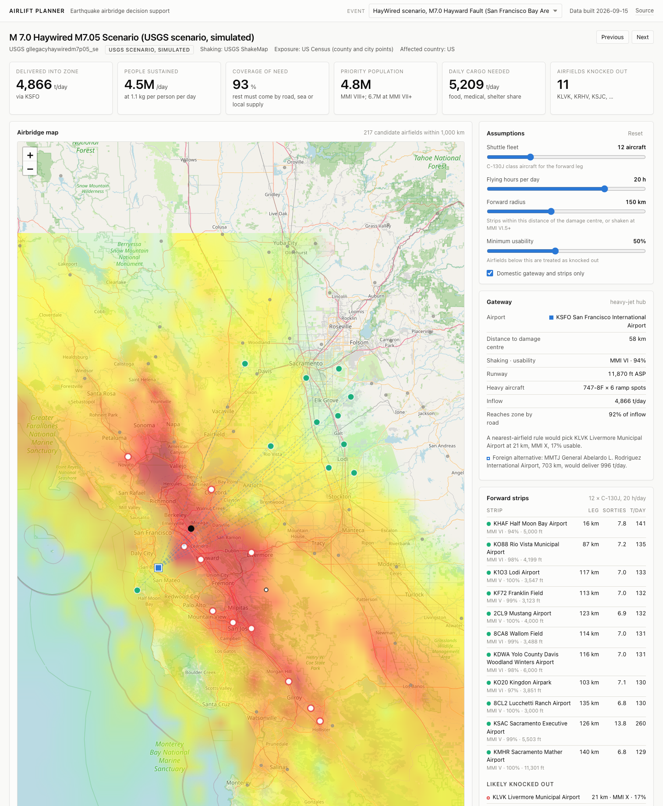

# Airlift Planner

After an earthquake: which airfields can still take relief flights, how much cargo is needed, and how much an airbridge can deliver. Public USGS and Census data only.

Dashboard: https://sachabidermann.github.io/airlift-planner/



*HayWired scenario, M7.0 Hayward Fault. Red rings: airfields expected to be out of action. Blue square: recommended gateway (SFO). Shading: USGS ShakeMap intensity.*

## What it does

1. Reads USGS ShakeMap intensity at every airport within 1,000 km and estimates whether each can accept flights.
2. Sizes daily relief demand from population exposure (USGS PAGER, or Census data for scenarios without it).
3. Plans a two-tier airbridge: heavy jets into a gateway, C-130s into strips inside the damage zone. Capacity comes from ramp spots and turnaround times.
4. Reports tonnes per day delivered, people sustained, and the share of need covered.

```
uv run main.py --quake gllegacyhaywiredm7p05_se
```

```
M 7.0  Haywired M7.05 Scenario  (USGS scenario, simulated)
shaking data: USGS ShakeMap v33, 2017-01-11

likely knocked out:
    KLVK Livermore Municipal Airport            21 km   MMI X    usable 20%
    KSJC Mineta San Jose International Airpo    24 km   MMI IX   usable 24%
    KOAK Oakland San Francisco Bay Airport      48 km   MMI IX   usable 27%
    ...

GATEWAY   KSFO San Francisco International Airport        58 km   MMI VII  usable 93%
          747-8F x 6 spots, 11,870 ft   inflow 4,833 t/day
FORWARD   shuttle fleet 12 x C-130J, 20 h/day
          KHAF Half Moon Bay Airport                 16km      7.8     140   VI
          KSAC Sacramento Executive Airport         126km     13.8     260   V
          ...

DELIVERED INTO ZONE    4,833 t/day
people sustained        4.4M/day
```

## Dashboard

`docs/` runs the same model in the browser. Pick an event, move the sliders (shuttle fleet, flying hours, forward radius, usability threshold, domestic only) and the plan, map, charts, ledger and scorecard update.

```
uv run dashboard/build.py                      # refresh docs/data.json
node dashboard/test_model.js                   # browser model must match the Python planner
python3 -m http.server 8766 --directory docs   # http://localhost:8766
```

`?theme=light` or `?theme=dark` forces a theme. The URL hash selects an event, e.g. `#wa22sfz01_se`.

## Backtests

Nine real earthquakes, compared with what relief operations did. Detail in [backtests/RESULTS.md](backtests/RESULTS.md).

| event | flagged as knocked out | actually closed | model gateway | gateway used | match |
|---|---|---|---|---|---|
| Loma Prieta 1989, M6.9 | none (Oakland 93%) | Oakland main runway, liquefaction | San Jose | San Francisco and San Jose both open | yes |
| Anchorage 2018, M7.1 | none | none | Anchorage | Anchorage | yes |
| Ridgecrest 2019, M7.1 | none | China Lake facilities | Mojave | none needed | n/a |
| Puerto Rico 2020, M6.4 | none | none | San Juan | none needed | n/a |
| Haiti 2010, M7.0 | none (Port-au-Prince 60%) | none; tower lost | Port-au-Prince | Port-au-Prince | yes |
| Nepal 2015, M7.8 | none (Kathmandu 87%) | none; runway damaged later | Kathmandu | Kathmandu | yes |
| Turkey 2023, M7.8 | Hatay, Kahramanmaras | Hatay | Gaziantep | Adana and Incirlik | no |
| Morocco 2023, M6.8 | none | none | Marrakech | Marrakech | yes |
| Myanmar 2025, M7.7 | Mandalay, Nay Pyi Taw, 3 small fields | Mandalay, Nay Pyi Taw | Heho | Yangon | no |

Gateway matches in 5 of the 7 events where one was used. Every airport closed by shaking was flagged; one false alarm (Kahramanmaras, 48%). Misses: Oakland 1989 failed from liquefaction, which intensity does not capture. In Turkey and Myanmar the model prefers an intact airport near the damage; operations chose a larger one further out for customs, fuel and handling.

The airport table is current, so older replays can include airports that did not exist at the time.

## Scenarios

Official USGS simulated earthquakes.

| scenario | people at MMI VIII+ | gateway | flagged as knocked out | delivered |
|---|---:|---|---|---|
| HayWired M7.0, Bay Area | 4.8M | San Francisco | Oakland, San Jose, Hayward, Livermore, 6 more | 4,833 t/day, 93% of need |
| ShakeOut M7.8, Los Angeles | 7.8M | Long Beach | San Bernardino, Ontario, Chino, Redlands, more | 4,810 t/day, 57% |
| Seattle Fault M7.5 | 2.4M | Whidbey Island NAS | Sea-Tac, Boeing Field, Renton, Bremerton | 2,020 t/day, 78% |
| New Madrid M7.7, Memphis | 306k | Memphis | 10 small fields | 4,777 t/day, exceeds need |
| Cascadia M9.0 | 115k | McChord AFB | none (tsunami not modelled) | 1,545 t/day, exceeds need |
| Puerto Rico Trench M8.5 | 1.4M | San Juan (62%) | none | 3,226 t/day, exceeds need |

Seattle and New Madrid use USGS PAGER exposure. The others use a Census reconstruction, labelled in the dashboard.

## Verification

`uv run backtests/verify_shaking.py` reads the grid at every city USGS PAGER rates for nine events (about 4,000 cities) and compares. Mean difference is within 0.1 to 0.2 intensity units for eight events; Anchorage differs more because USGS revised the ShakeMap after PAGER ran. The legacy grid parser agrees with the modern format to 0.003. Results in [backtests/VERIFICATION.md](backtests/VERIFICATION.md).

## Live events

ShakeMap is revised for hours or days after a quake. The tool caches the version it first downloads and prints the version number. During a response, re-run with `--refresh` to fetch the latest. Small quakes with no ShakeMap use a distance formula (Allen, Wald and Worden 2012); on real events it is off by about 0.6 intensity units on average, and the output says when it is in use.

## How it works

| step | module | data |
|---|---|---|
| Quake, shaking grid, exposure; real events and scenarios | `airlift/usgs.py` | USGS feed, scenario catalog, ShakeMap, PAGER |
| Exposure for scenarios without PAGER | `airlift/population.py` | Census population estimates, Gazetteer centroids |
| Airports and runways | `airlift/airports.py` | OurAirports |
| Intensity to usability | `airlift/survivability.py` | judgement curve, nine events |
| Exposure to tonnes per day | `airlift/demand.py` | WFP and Sphere figures |
| Gateway, shuttles, coverage | `airlift/airbridge.py` | ramp spots, turnarounds, payloads |
| Report and map | `airlift/report.py`, `docs/` | Leaflet, OpenStreetMap |

Design notes:

- Damage centre is the shaking-weighted centroid of the grid, not the epicentre.
- Every candidate gateway is worked out in full; none are pre-filtered on capacity.
- Gateways in the affected country are preferred. US territories count as domestic.
- Cargo at a gateway counts as delivered within 50 km of the damage centre, fading to zero at 150 km.
- Regional airports are capped at C-17 class aircraft.

## Limitations

Not an operational tool. The usability curve is judgement. Aircraft figures are public planning approximations. Distances are straight-line. No liquefaction, tsunami, fuel, customs, handling, weather, airspace or roads.

## Run it

Requires [uv](https://docs.astral.sh/uv/).

```
git clone https://github.com/sachabidermann/airlift-planner
cd airlift-planner
uv sync
uv run main.py --list
uv run main.py --latest
uv run main.py --quake sclegacyshakeout2full_se
uv run main.py --quake us6000jllz --fleet 24 --forward-km 200
uv run backtests/run.py
uv run backtests/verify_shaking.py
```

## Roadmap

- Fit the usability curve on every M6.5+ quake since 2000 with a known airport outcome
- Liquefaction susceptibility for runways on fill
- Tsunami inundation for coastal strips
- Road travel time instead of straight-line credit
- Helicopter tier for areas without a strip
- Fuel and handling proxies for gateway choice

## Prior art

Palantir has supported disaster response through [Direct Relief](https://www.directrelief.org/2013/02/palantir-expands-commitment-to-help-improve-disaster-response/), [Team Rubicon](https://www.prnewswire.com/news-releases/palantir-technologies-creates-clinton-global-initiative-commitment-to-action-partners-with-team-rubicon-and-direct-relief-to-revolutionize-disaster-response-efforts-193074341.html) and [AIP for Infrastructure Resiliency](https://www.palantir.com/partnerships/jacobs/IRDR/). That work integrates an organisation's own data into an operating picture. Nothing public describes an airfield survivability or airbridge capacity model from ShakeMap. This would be a domain model on top of such a platform.

Sacha Bidermann, 2026.
